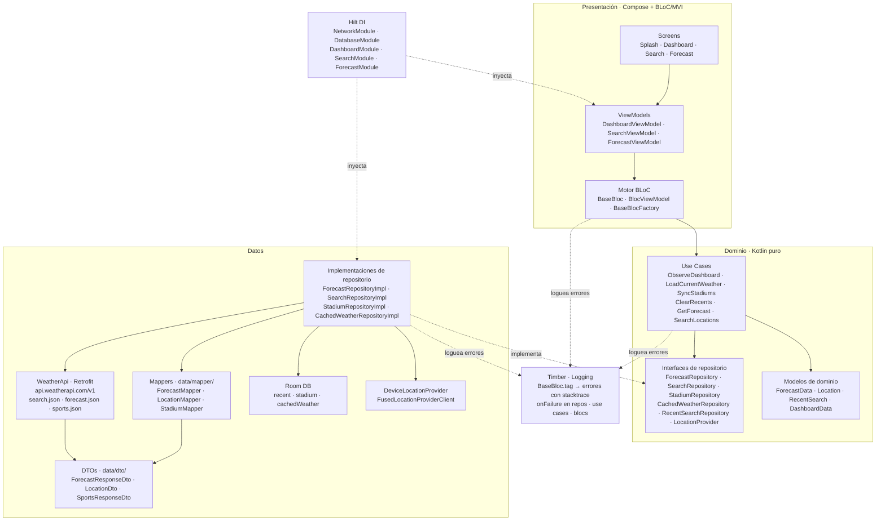
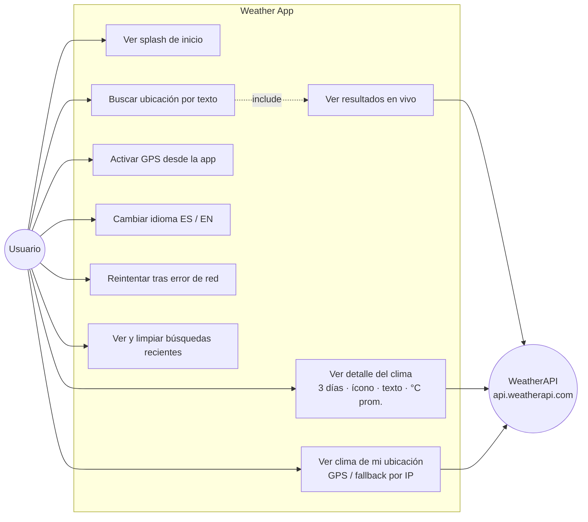

# Weather

> **Prueba técnica Bold** — Aplicación Android nativa para consultar el clima actual y el pronóstico de los próximos 3 días, usando la API pública de [WeatherAPI](https://www.weatherapi.com/).

---

## Capturas de pantalla

> Reemplaza los archivos en la carpeta `screenshots/` después de compilar el proyecto.
> Tamaño sugerido: 360 × 780 px (portrait) · 780 × 360 px (landscape).

| Splash | Dashboard | Búsqueda | Pronóstico | Landscape | Error |
|:------:|:---------:|:--------:|:----------:|:---------:|:-----:|
|  |  |  |  |  |  |

---

## Descripción

Aplicación Android 100% nativa que permite buscar cualquier ciudad del mundo y consultar el clima actual junto con el pronóstico de los 2 días siguientes. Consume los endpoints `search.json` y `forecast.json` de WeatherAPI.

Además de los requisitos mínimos del enunciado, incluye: pronóstico horario, datos astronómicos (amanecer, atardecer, fase lunar), alertas meteorológicas, localización automática por GPS con fallback por dirección IP, caché local con Room, soporte bilingüe ES/EN con cambio en tiempo real y una sección de estadios del Mundial FIFA 2026.

---

## Requisitos del enunciado — estado de implementación

| # | Requisito | Estado | Dónde |
|---|-----------|:------:|-------|
| 1 | Splash que presenta la app | ✅ | `AndroidX SplashScreen` (API 26+) + `SplashScreen.kt` con animación Lottie |
| 2 | Pantalla de búsqueda por texto | ✅ | `feature/search/presentation/SearchScreen.kt` |
| 3 | Resultados en vivo al escribir | ✅ | `SearchLocationsUseCase` → `Flow` + `debounce(300 ms)` + `flatMapLatest` |
| 4 | Cada resultado: nombre y país | ✅ | `ResultRow` → `location.name` + `location.region, location.country` |
| 5 | Detalle: nombre, 3 días, ícono + texto, avgtemp °C | ✅ | `ForecastScreen` → `DayGlassCard` (ícono + texto de condición + `avgTempC`) |
| 6 | Cambio de orientación | ✅ | `configChanges` en Manifest + layouts portrait/landscape en los 3 screens principales |
| — | Manejo de errores inesperados | ✅ | `WeatherError` sellado, mensajes `@StringRes`, estado de reintento en pantalla |
| — | Componentes de arquitectura Android | ✅ | `ViewModel` + `StateFlow` + `Room` + `Hilt` |
| — | minSdk 26 / targetSdk 36 | ✅ | `app/build.gradle.kts` |
| Extra | Tests | ✅ | 9 tests unitarios: use cases, blocs, repositorio (JUnit4 + MockK + coroutines-test) |

---

## Stack tecnológico

| Categoría | Librería / Tecnología | Versión |
|-----------|----------------------|---------|
| Lenguaje | Kotlin | 2.1.20 |
| UI | Jetpack Compose + Material 3 | BOM 2024.12.01 |
| Navegación | Navigation Compose | 2.8.5 |
| Inyección de dependencias | Hilt (Dagger) | 2.60 |
| Red | Retrofit + OkHttp + kotlinx.serialization | 2.11.0 / 4.12.0 / 1.8.0 |
| Persistencia local | Room | 2.7.1 |
| Async | Kotlin Coroutines + Flow | 1.10.1 |
| Imágenes | Coil 3 (coil-network-okhttp) | 3.0.4 |
| Animaciones | Lottie Compose | 6.6.0 |
| Logging | Timber | 5.0.1 |
| Localización | Play Services Location (FusedLocationProvider) | 21.3.0 |
| Build | Android Gradle Plugin | 9.1.1 |
| SDK mínimo / objetivo | API 26 (Android 8) / API 36 | — |

---

## Arquitectura

La aplicación implementa **Clean Architecture** con la presentación organizada bajo un patrón **BLoC/MVI propio**. El código se agrupa por **feature vertical** (splash, dashboard, search, forecast), y cada feature se divide internamente en tres capas:

```
feature/<nombre>/
├── data/
│   ├── dto/       # DTOs de Retrofit (respuestas crudas de la API, anotadas con @Serializable)
│   ├── mapper/    # Funciones de extensión puras que convierten DTO → modelo de dominio
│   └── *Impl.kt  # Implementaciones de repositorio (orquestan dto + mapper + Room/API)
├── domain/        # Modelos puros, interfaces de repositorio, use cases
└── presentation/  # ViewModel, Blocs, Composables, estados y eventos de UI
```

Los **mappers** son objetos sin estado: funciones `fun XDto.toDomain(): X` que no conocen ni Room ni Retrofit. Esto permite testearlos de forma aislada y mantiene los repositorios libres de lógica de transformación.

### Motor BLoC/MVI

En lugar de exponer múltiples `StateFlow` por pantalla, cada screen tiene un **único estado inmutable** y un conjunto de **eventos tipados**. La lógica de cada evento se encapsula en una clase de responsabilidad única (`BaseBloc`):

| Clase | Responsabilidad |
|-------|----------------|
| `BlocViewModel` | Expone un único `StateFlow<State>` y un punto de entrada `onEvent(Event)` |
| `BaseBlocFactory` | Mapea `KClass<Event>` → `BaseBloc` responsable de ese evento (DSL `with`) |
| `BaseBloc` | Procesa un tipo de evento concreto y actualiza el estado via `updateState` |
| `BlocMap` | Estructura de datos interna del factory (mapa tipado `KClass → Bloc`) |
| `BaseEvent` / `BaseState` | Interfaces marcadoras para eventos y estados |

El `ViewModel` no contiene lógica de negocio: solo delega al `BlocFactory` y expone el estado resultante al árbol de Composables.

### Regla de dependencias

```
Presentación  ──▶  Dominio  ◀──  Datos
```

La capa **Datos** *implementa* interfaces definidas en **Dominio** (inversión de dependencias via Hilt `@Binds`). El **Dominio** es Kotlin puro. La **Presentación** solo consume use cases e interfaces de dominio, nunca implementaciones concretas.

### Diagrama de arquitectura



---

## Diagrama de casos de uso



---

## Estructura del proyecto

```
app/src/main/java/com/francisco/weather/
│
├── MainActivity.kt              # @AndroidEntryPoint — host Compose + locale controller
├── WeatherApplication.kt        # @HiltAndroidApp
│
├── core/
│   ├── bloc/                    # Motor BLoC: BaseBloc (con Timber.tag), BlocViewModel, BaseBlocFactory, BlocMap
│   ├── data/
│   │   ├── local/               # Room: WeatherDatabase · DAOs + Entities (recent, stadium, cachedWeather)
│   │   └── recent/              # RecentSearchRepositoryImpl
│   ├── di/                      # NetworkModule (Retrofit, OkHttp, WeatherApi) · DatabaseModule (Room, repos)
│   ├── domain/recent/           # RecentSearch (modelo) · RecentSearchRepository (interfaz)
│   ├── i18n/                    # AppLanguage, AppLocale, LocaleManager, LocalLocaleController
│   ├── network/                 # WeatherApi · ApiKeyInterceptor · WeatherError · ErrorText
│   └── ui/
│       ├── components/          # SkyScaffold (gradiente de cielo compartido)
│       ├── sky/                 # SkyTheme · rememberSkyColors() · lerpSky()
│       └── theme/               # WeatherTheme · Color · Type · WeatherColors
│
├── feature/
│   ├── splash/presentation/     # SplashScreen (animación Lottie local · splash_weather.lottie)
│   │
│   ├── dashboard/
│   │   ├── data/
│   │   │   ├── dto/             # SportsResponseDto
│   │   │   ├── mapper/          # StadiumMapper (DTO → WorldCupStadium)
│   │   │   └── *Impl.kt         # StadiumRepositoryImpl · CachedWeatherRepositoryImpl · DeviceLocationProvider
│   │   ├── di/                  # DashboardModule
│   │   ├── domain/              # usecase/ (ObserveDashboard · LoadCurrentWeather · SyncStadiums · ClearRecents)
│   │   │                        # model/ (DashboardData · WorldCupStadium · ResolvedWeather · Coordinates)
│   │   └── presentation/        # DashboardViewModel · Blocs (5) · composables/ · screens/ (portrait + landscape)
│   │
│   ├── search/
│   │   ├── data/
│   │   │   ├── dto/             # LocationDto
│   │   │   ├── mapper/          # LocationMapper (DTO → Location)
│   │   │   └── SearchRepositoryImpl.kt
│   │   ├── di/                  # SearchModule
│   │   ├── domain/              # usecase/ (SearchLocations · SearchResults sealed) · model/Location
│   │   └── presentation/        # SearchViewModel · Blocs (3) · composables/ · screens/ (portrait + landscape)
│   │
│   └── forecast/
│       ├── data/
│       │   ├── dto/             # ForecastResponseDto
│       │   ├── mapper/          # ForecastMapper (DTO → ForecastData)
│       │   └── ForecastRepositoryImpl.kt
│       ├── di/                  # ForecastModule
│       ├── domain/              # usecase/ (GetForecast) · model/ (ForecastData · DayWeather · HourWeather · Astro…)
│       └── presentation/        # ForecastViewModel · Blocs (2) · composables/ · screens/ (portrait + landscape)
│
└── navigation/
    ├── WeatherDestinations.kt   # Rutas constantes: splash · dashboard · search · forecast/{locationQuery}
    └── WeatherNavHost.kt        # NavHost con lifecycle-guarded navigation (solo navega en RESUMED)
```

---

## Cómo ejecutar

### Requisitos previos

- **Android Studio** Meerkat 2024.3 o superior
- **JDK 17**
- Dispositivo físico o emulador con **API 26+**

### 1. Configurar la clave de API

Crea (o edita) el archivo `local.properties` en la **raíz del proyecto** (ya está en `.gitignore`) y añade la siguiente línea:

```properties
WEATHER_API_KEY=tu_clave_aquí
```

La clave se lee en tiempo de compilación desde `app/build.gradle.kts` y queda disponible en `BuildConfig.WEATHER_API_KEY`. En tiempo de ejecución, `ApiKeyInterceptor` la adjunta automáticamente como parámetro `key=` en cada petición a `api.weatherapi.com/v1`.

> Puedes obtener una clave gratuita en [weatherapi.com/signup](https://www.weatherapi.com/signup.aspx).

### 2. Compilar y ejecutar

```bash
# Compilar APK de debug
./gradlew assembleDebug

# Instalar directamente en un dispositivo conectado
./gradlew installDebug

# Correr los tests unitarios
./gradlew test
```

O simplemente abre el proyecto en Android Studio y pulsa **Run ▶**.

---

## Pruebas

Se implementaron **9 tests unitarios** con **JUnit4 + MockK + kotlinx.coroutines-test**:

| Test | Capa | Qué verifica |
|------|------|-------------|
| `SearchRepositoryImplTest` | Data | Mapeo de DTOs, errores HTTP/red/lista vacía → `WeatherError` |
| `SearchLocationsUseCaseTest` | Domain | Debounce, `flatMapLatest`, `distinctUntilChanged`, consulta en blanco, emisión de errores |
| `LoadCurrentWeatherUseCaseTest` | Domain | Ruta GPS vs. fallback IP (`auto:ip`), guardado en caché |
| `ObserveDashboardUseCaseTest` | Domain | `combine` reactivo de tres Flows (recientes + estadios + caché) |
| `GpsStateChangedBlocTest` | Presentation | Reductor de estado GPS puro (sin efectos secundarios) |
| `LocationPermissionResultBlocTest` | Presentation | Reductor de estado de permiso de ubicación |
| `LoadCurrentWeatherBlocTest` | Presentation | Delegación al use case, flag de ubicación aproximada, manejo de errores |
| `LoadForecastBlocTest` | Presentation | Estados de éxito, error de red y error HTTP |
| `SearchQueryBlocTest` | Presentation | Propagación de consulta, limpieza de error, delegación al use case |

```bash
./gradlew test
```

---

## Decisiones de diseño

### BLoC/MVI propio vs. MVVM estándar

Adoptar un único estado inmutable por pantalla y eventos tipados en lugar de múltiples `StateFlow` simplifica el razonamiento sobre el estado de la UI: siempre hay un solo punto de verdad. Encapsular la lógica de cada evento en un `BaseBloc` independiente permite testarla en total aislamiento sin instanciar el `ViewModel` completo, lo que se refleja directamente en la cobertura de tests.

### Room como fuente de verdad del Dashboard

El `DashboardScreen` combina tres fuentes de datos (búsquedas recientes, estadios sincronizados y clima cacheado) usando `combine` sobre tres `Flow<…>` de Room. La pantalla reacciona reactivamente a cualquier escritura, sin necesidad de actualización manual ni llamadas extra a la API al volver a la pantalla.

### GPS → fallback por IP

`LoadCurrentWeatherUseCase` intenta resolver la ubicación real via `FusedLocationProviderClient`. Si el permiso es denegado o el GPS no está activo, cae automáticamente a `q=auto:ip` (WeatherAPI resuelve la ubicación por IP del dispositivo). El usuario ve el clima relevante sin necesidad de conceder permisos.

### i18n en tiempo de ejecución

El idioma cambia sin reiniciar la app: `LocaleManager` combina `SharedPreferences` para persistencia con un `mutableStateOf` de Compose para recomponer todo el árbol UI al instante. El interceptor de red añade `lang=es|en` a cada petición para que el campo `condition.text` llegue localizado directamente desde la API.

### Logging y observabilidad con Timber

Timber reemplaza los llamados directos a `android.util.Log`. El árbol se planta una sola vez en `WeatherApplication.onCreate()` guardado por `BuildConfig.DEBUG` (en release es un no-op sin código extra en cada llamada).

El logging de errores está cableado en dos niveles complementarios:

- **`BaseBloc.run()`** — captura cualquier excepción que escape de `handleEvent` y la loguea con `Timber.tag(tag).e(...)`, usando el `override val tag` del bloc concreto (ej. `LoadForecastBloc`). Luego relanza para que `BlocViewModel.handleError` también reciba el error. Así el stacktrace queda etiquetado con el nombre exacto del bloc que falló.
- **Callbacks `onFailure`** — en repos (`ForecastRepositoryImpl`, `SearchRepositoryImpl`), use cases (`SearchLocationsUseCase`) y blocs (`LoadForecastBloc`, `LoadCurrentWeatherBloc`), `Timber.e(cause, "…")` registra el error en el momento en que se transforma en `WeatherError` tipado. Los blocs usan `Timber.tag(tag)` para mantener la trazabilidad.

En tests unitarios no se planta ningún árbol, por lo que `Timber` es un no-op y no rompe ningún test existente.

### Gradiente de cielo dinámico según la hora

El fondo de todas las pantallas refleja el momento del día mediante un gradiente de tres colores (`top`, `mid`, `bottom`) que se interpola suavemente entre 8 fotogramas clave basados en la hora del reloj del dispositivo:

| Rango horario | Estado del cielo |
|:---:|:---:|
| 00:00 – 05:00 | Noche |
| 05:00 – 07:00 | Amanecer |
| 07:00 – 17:00 | Día |
| 17:00 – 20:00 | Atardecer |
| 20:00 – 24:00 | Noche |

La transición entre etapas se realiza mediante interpolación lineal de color (`lerpSky`), lo que produce cambios graduales de 1-2 horas sin saltos. Adicionalmente, `starOpacity` controla la visibilidad de estrellas decorativas en pantalla (0 de día → 1 de noche).

Para evitar recomposiciones excesivas, `rememberSkyColors()` agrupa la hora en buckets de 5 minutos: el estado solo cambia cada 5 minutos reales, no en cada frame. El gradiente se aplica en `SkyScaffold` (`core/ui/components/`) y es compartido por Dashboard, Search y Forecast.

---

## Sobre el uso de IA

Las decisiones de arquitectura, los patrones de diseño (Clean Architecture + BLoC/MVI), la organización del proyecto y la estrategia de implementación son de mi autoría. Utilicé herramientas de IA (Claude) como asistente para acelerar la implementación de código repetitivo y para redactar esta documentación, siempre bajo mi dirección, revisión y criterio técnico.

---

## Autor

**Francisco Montúfar**  
franciscomontufar28@gmail.com
